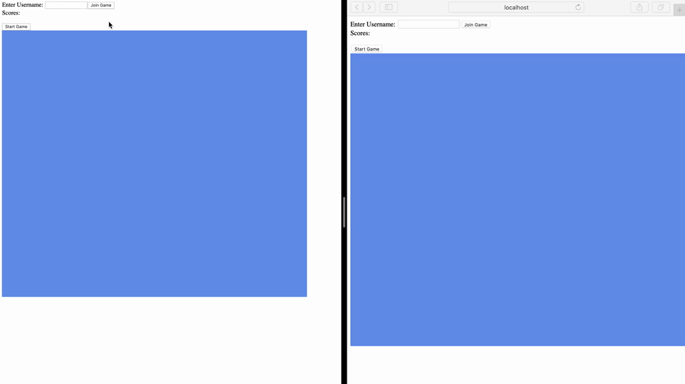

# ball-game 
### A multiplayer game where you can compete to collect more balls and thus earn points

## Features
- The users can enter their own username and join a room
- Upon clicking on start game, all the users that joined the room start playing
- The users should start collecting the small balls
- The user's own ball is displayed in green color
- The balls bounce off the walls when they reach them 
- Users can change ball direction with the arrow keys
- The user that collects more balls, wins the game
- Multiple games can be played simultaneously

## Used techniques
- Java, Spring
- Javascript, HTML, CSS

## Game screens:

